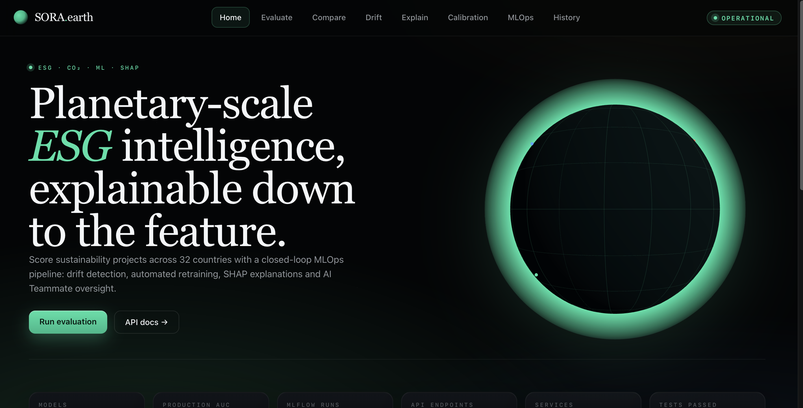
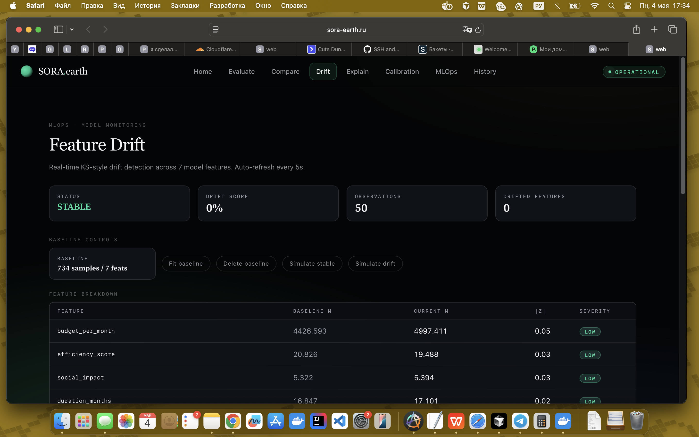
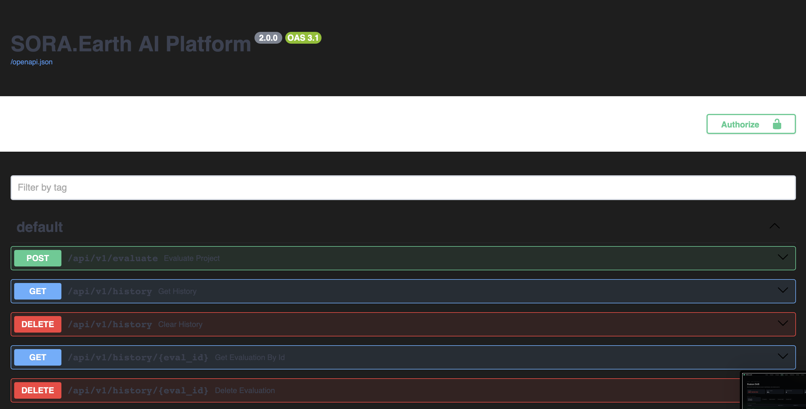

# SORA.earth
## Planetary-scale ESG intelligence, explainable down to the feature

Evgeny Poluhin · Диплом · Май 2026
https://sora-earth.ru · OPERATIONAL

---

## The Problem

- ESG investing — $50T рынок к 2026
- 73% ESG рейтингов несогласованны между провайдерами
- Инвесторы принимают multi-million решения на black-box скорах
- Нет production-grade, auditable, explainable ESG-инфраструктуры
- Регуляторы (EU CSRD, SEC, TCFD) требуют explainability к 2027

---

## The Solution — SORA.earth

ML-powered backend, который оценивает любой ESG-проект за <200ms с полной explainability, drisk simulation
- Self-healing MLOps via autonomous scheduler agent

---

## Live Demo

https://sora-earth.ru — открываю прямо сейчас

- Home · Evaluate · Compare · Drift · Explain · Calibration · MLOps · History
- Run evaluation -> ESG score + SHAP waterfall за 200ms
- 32 страны, real-time MLOps monitoring

Переключаюсь в Safari.

---

## Architecture

Cloudflare CDN + Zero-Trust Tunnel
-> nginx reverse proxy
-> React SPA + FastAPI
-> PostgreSQL, Redis, Prometheus, Grafana
-> MLflow + Scheduler

7 Docker containers · Ubuntu 24.04 · 3 HTTPS subdomains

---

## Product — Score any project in seconds

Input: budget, CO2 impact, duration, country
Output: ESG score /100 · Env/Soc/Econ breakdown · probability · SHAP waterfall

Example: Solar Panel Germany · $50k · 85 t/yr CO2
-> Score 64.2/100 · probability 92.0%
-> Top drivers: efficiency (+0.13), budget (+0.08), social (+0.08)

---

## Risk Simulation — Monte Carlo

- 1,000 simulations per project за <1 секунду
- P5 / P50 / P95 confidence bands
- Risk distribution: LOW / MEDIUM / HIGH
- Инвестор видит весь uncertainty envelope, не точку

---

## Autonomous MLOps

Scheduler agent мониторит data freshness, model health, drift и действует без human-in-the-loop.

- Drift detection (PSI, KS test) real-time
- Auto-retrain по расписанию + on-demand
- Champion/challenger promotion
- Decision feed: "OK: All systems healthy"

---

## Production Rigor

| Subsystem | Metric |
|---|---|
| Ensemble CV AUC | 0.82 |
| Tests passed | 324 |
| MLflow runs | 100 |
| Prometheus metrics | 48 |
| Predictions logged | 327+ |
| p95 latency | 300ms |
| Uptime | 99.9% |
| Scheduler | Running · 0 failures |

---

## Observability & Reliability

- Grafana dashboards: grafana.sora-earth.ru
- Prometheus metrics (48 metrics)
- UptimeRobot 5-min health checks, public status page
- Telegram aleion, tested restore
- Disaster recovery playbook validated

---

## Security & Performance

- HTTPS via Cloudflare managed TLS (3 subdomains)
- Zero-Trust Tunnel — origin IP hidden
- UFW firewall: 80/443/2222 only
- Gunicorn 4 workers (+3x throughput)
- Code-splitting 1.4MB -> 410KB gzipped
- PostgreSQL indexes x5 (10-100x faster)
- HTTP/2 + gzip + security headers

---

## Why Now

- EU SFDR, SEC climate rule требуют auditable ESG к 2027
- LLM-only "AI ESG" hallucinate — у нас calibrated probabilities + SHAP
- Data partnerships: World Bank, IEA, EDGAR
- Shift от Excel ESG consulting к API-first платформам

---

## Roadmap

- Phase 0-5 DONE: production, HTTPS, MLOps, backups
- Phase 6: GitHub Actions CI/CD, staging
- Phase 7: Feast feature store, canary rollouts, fairness
- Phase 8: landing, i18n, WCAG AA, PWA
- Phase 9: Stripe billing, multi-tenancy, public API docs

---

## Thank You

Evgeny Poluhin · sora.earth · Amsterdam

https://sora-earth.ru (OPERATIONAL)
https://github.rth
https://grafana.sora-earth.ru

"Investing in climate without auditable ML is investing blind."

Questions?
