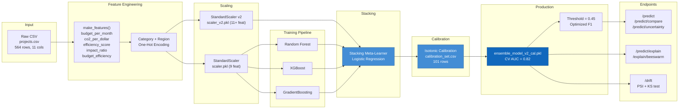

```mermaid
graph LR
    subgraph Input
        RAW["Raw CSV<br>projects.csv<br>564 rows, 11 cols"]
    end

    subgraph Feature_Engineering["Feature Engineering"]
        FE["make_features()<br>budget_per_month<br>co2_per_dollar<br>efficiency_score<br>impact_ratio<br>budget_efficiency"]
        CAT["Category + Region<br>One-Hot Encoding"]
    end

    subgraph Scaling
        SC1["StandardScaler<br>scaler.pkl (9 feat)"]
        SC2["StandardScaler v2<br>scaler_v2.pkl (11+ feat)"]
    end

    subgraph Training["Training Pipeline"]
        RF["Random Forest"]
        XGB["XGBoost"]
        GB["GradientBoosting"]
    end

    subgraph Stacking
        META["Stacking Meta-Learner<br>Logistic Regression"]
    end

    subgraph Calibration
        CALIB["Isotonic Calibration<br>calibration_set.csv<br>101 rows"]
    end

    subgraph Production
        FINAL["ensemble_model_v2_cal.pkl<br>CV AUC = 0.82"]
        THRESH["Threshold = 0.45<br>Optimized F1"]
    end

    subgraph Endpoints
        PRED["/predict<br>/predict/compare<br>/predict/uncertainty"]
        SHAP_V["/predict/explain<br>/explain/beeswarm"]
        DRIFT_V["/drift<br>PSI + KS test"]
    end

    RAW --> FE
    FE --> CAT
    CAT --> SC1
    CAT --> SC2
    SC1 --> RF
    SC1 --> XGB
    SC1 --> GB
    SC2 --> META
    RF --> META
    XGB --> META
    GB --> META
    META --> CALIB
    CALIB --> FINAL
    FINAL --> THRESH
    THRESH --> PRED
    FINAL --> SHAP_V
    FINAL --> DRIFT_V

    style FINAL fill:#1168bd,stroke:#0b4884,color:#fff
    style META fill:#438dd5,stroke:#2e6295,color:#fff
    style CALIB fill:#438dd5,stroke:#2e6295,color:#fff
```
