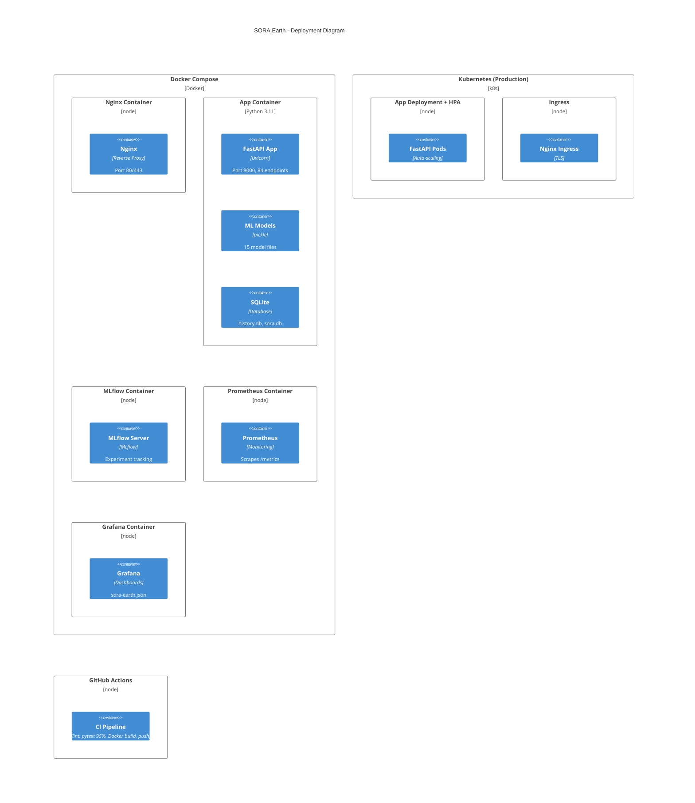

```mermaid
C4Deployment
    title SORA.Earth - Deployment Diagram

    Deployment_Node(docker, "Docker Compose", "Docker") {
        Deployment_Node(nginx_c, "Nginx Container") {
            Container(nginx, "Nginx", "Reverse Proxy", "Port 80/443")
        }
        Deployment_Node(app_c, "App Container", "Python 3.11") {
            Container(fastapi, "FastAPI App", "Uvicorn", "Port 8000, 84 endpoints")
            Container(models_d, "ML Models", "pickle", "15 model files")
            Container(sqlite, "SQLite", "Database", "history.db, sora.db")
        }
        Deployment_Node(mlflow_c, "MLflow Container") {
            Container(mlflow_s, "MLflow Server", "MLflow", "Experiment tracking")
        }
        Deployment_Node(prom_c, "Prometheus Container") {
            Container(prom_s, "Prometheus", "Monitoring", "Scrapes /metrics")
        }
        Deployment_Node(graf_c, "Grafana Container") {
            Container(graf_s, "Grafana", "Dashboards", "sora-earth.json")
        }
    }

    Deployment_Node(k8s, "Kubernetes (Production)", "k8s") {
        Deployment_Node(k8s_app, "App Deployment + HPA") {
            Container(k8s_api, "FastAPI Pods", "Auto-scaling")
        }
        Deployment_Node(k8s_ingress, "Ingress") {
            Container(k8s_ing, "Nginx Ingress", "TLS")
        }
    }

    Deployment_Node(ci, "GitHub Actions") {
        Container(ci_pipe, "CI Pipeline", "lint, pytest 95%, Docker build, push")
    }
```
